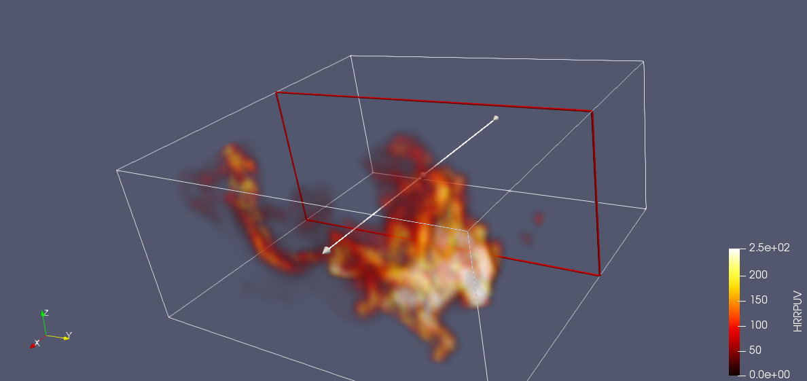
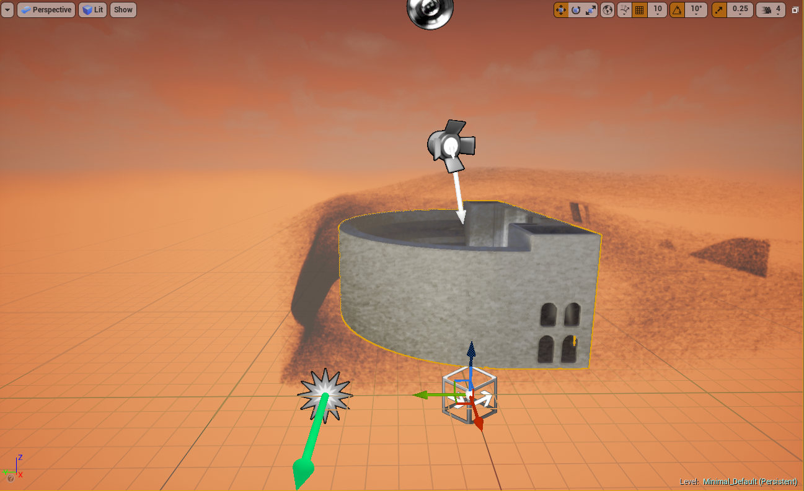

# FDS2VTK

Exporter les résultats de simulation de [FDS](https://pages.nist.gov/fds-smv/) vers d'autres formats, pour aboutir finalement à des visualisations "réalistes" du feu dans des moteurs de rendu ou de jeu.

### Contexte

Les résultats de simulation (sorties de FDS) sont visualisables via SmokeView, mais difficilement exportables vers d'autres formats. Il existe toutefois un utilitaire écrit en FORTRAN, fds2ascii, permettant de faire certaines conversions.

-> Analyser les fichiers de sortie de FDS pour extraire des données en grille structurée (voxels en x, y et z) de la concentration de suie dans l'air (SOOT) et de la flamme (Heat Release Per Volume).

Une fois ces données extraites, trouver un moyen pour convertir les infos vers un moteur de jeu pour ajouter des systèmes de particule simulant le feu, [exemple ici](https://youtu.be/mmrTUgUC9y8)
Prendre par exemple au maximum de distance de l'isosurface de temperature une image assez grande de flamme, alors que plus proche de l'isosurface les flammes seront plus petites, ou au moins plus transparentes?

CF:
* [Use images as particle positions](https://forums.unrealengine.com/development-discussion/blueprint-visual-scripting/63159-how-to-place-single-gpu-particles-at-specified-locations)
* [Nvidia fire simulation](https://developer.nvidia.com/nvidia-flow) and [associated demo](https://www.youtube.com/watch?v=Ea1ofhkNXuQ)
* [A tutorial for creating fire in unreal](https://www.youtube.com/watch?v=hZLbGvtyS6g)
* [Import Sprite sheet in Unreal](https://wiki.unrealengine.com/Sprite_Sheet:_How_to_import_outside_images_sequences_in_UE4)
* [Vertex animation: blender to Unreal](https://www.youtube.com/watch?v=CUTc4agcWa4)
* [Blender fluids simulation to UE4 :D](https://www.youtube.com/watch?v=YTDEdZovHbw)

### Fichiers

#### 1 - fds2ascii
```
python fds2ascii.py --input /input/dir/path/ -o /output/dir/path/ --start startIndex --end endIndex --run
```
**--input** correspond au dossier dans lequel se trouvent les résultats de la simulation (avec un seul fichier .smv dans ce dernier), et **--output** correspond au dossier de sortie dans lequel seront écrits les fichiers .vtk (dossier à créer au préalable).

**--run** permet de faire tourner le script (peut durer plusieurs minutes). Si non renseigné, le script donne des infos sur les fichiers mais ne se lance pas.

**startIndex** et **endIndex** sont les numéros des frames de début et de fin d'export pour l'animation.

Les fichiers de sortie sont visualisables avec Paraview sous forme d'animation. Avant l'écriture des fichiers .vtk, la donnée est stockée dans des tableaux 1D, et peut être réexploitée, convertie en .mesh, isosurfacée... etc.



#### 2 - meshToFGA ([Infos](https://wiki.unrealengine.com/Creating_Vector_Fields_(Tutorial))
```
python meshToFGA.py /path/to/the/.mesh
```
Le fichier .mesh doit être associé à un fichier .sol, contenant en chaque noeud du modèle tétrahédrique un vecteur 3D de vitesse.

Le fichier .fga créé peut ensuite être réimporté dans unreal engine pour influencer un système de particules en tant que champ de vecteur global, par exemple (théatre d'orange):



#### 3 - readbobj

Adapter [ce code](http://www.clintons3d.com/plugins/downloads/read_blender_fluids.py) pour lire puis réécrire les fichiers de cache de blender, et y charger une simulation de fluide "custom", comme celle de FDS.

**Edit:** Le code fonctionne -> possible d'overwriter les caches d'un baking de blender avec des mailages persos en supprimant les anciens .bobj.gz, et en incoporant les resultats de la simulation.

<video src="http://iscd.upmc.fr/fds/render.avi" poster="fds2blender.jpg" width="320" height="200" controls preload></video>
